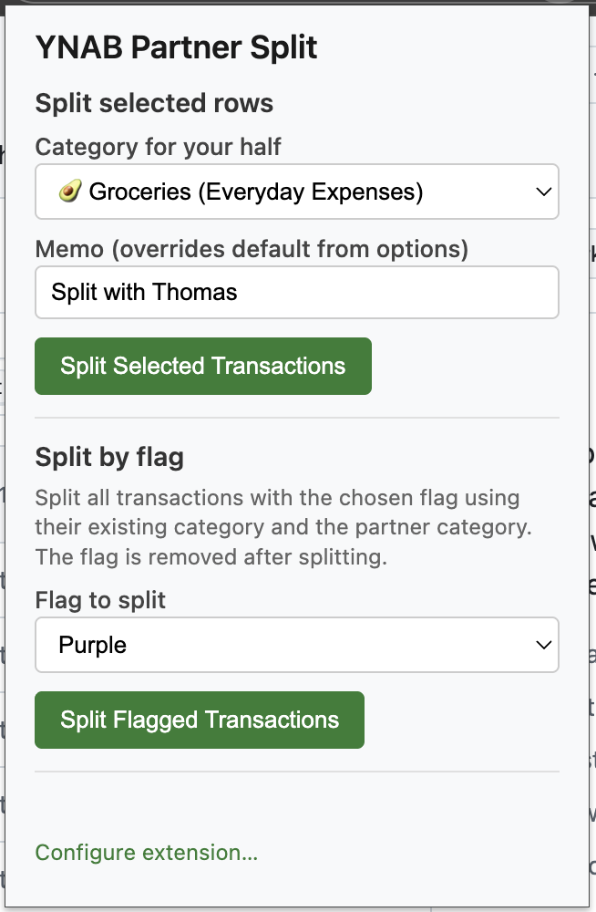
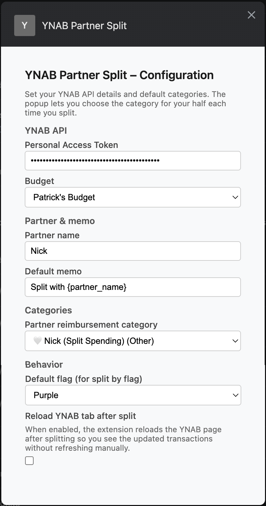
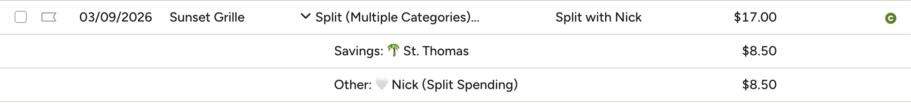

# YNAB Partner Split

A Chrome extension (Manifest V3) that integrates with the [YNAB API](https://api.ynab.com) to split selected transactions 50/50 between your category and a configurable partner reimbursement category.

**Example:** A $40 grocery purchase becomes:
- $20 → Groceries (your half)
- $20 → Partner reimbursement category (e.g. "Nick Split Spending")

The extension runs on [app.ynab.com](https://app.ynab.com). You select one or more transactions in the YNAB UI, then use the popup to choose categories and split.

**Configuration** is on a separate options page: right‑click the extension icon → **Options**, or click **Configure extension…** in the popup.

---

## Install (no Chrome Web Store)

You can install the extension in a few steps without publishing it to the Chrome Web Store.

### Step 1: Get the extension files

**Recommended:** Use the latest release so you get a tested build.

1. Go to the [Releases](https://github.com/patrickfweston/ynab-partner-split/releases) page for this repo.
2. Open the **latest release** (e.g. v1.0.0).
3. Download **Source code (zip)** from the assets at the bottom.
4. Unzip the file somewhere on your computer (e.g. Desktop or Documents).

Avoid using the green **Code** → **Download ZIP** button on the main branch; that gives you the current development code, which may be ahead of the latest release.

You need the **folder** that contains `manifest.json`, `popup.html`, `content.js`, and the other extension files (not the ZIP itself). After unzipping a release, the folder is usually named `ynab-partner-split-1.0.0` or similar (it includes the version).

### Step 2: Load the extension in Chrome

1. Open Chrome and in the address bar type: `chrome://extensions`
2. Turn **Developer mode** on (toggle in the top-right corner).
3. Click **Load unpacked**.
4. In the file picker, select the **unzipped folder** that contains `manifest.json` (the extension root).
5. Click **Select Folder** (or **Open** on Mac).

The extension should appear in your list and its icon will show in the Chrome toolbar. You can pin it via the puzzle piece icon if you like.

### Step 3: Configure once

**Get your YNAB key first:** Sign in at [app.ynab.com](https://app.ynab.com) → **Account Settings** (gear icon) → **Developer Settings** → under **Personal Access Tokens**, click **New Token**, enter your password, and copy the token. Treat it like a password and keep it private.

Then right‑click the extension icon → **Options**, and enter that token plus your budget, partner details, and categories (see [Configuration](#configuration) for the full list).

### Updating the extension

There is no auto-update when you install this way. To get a new version: download **Source code (zip)** from the [latest release](https://github.com/patrickfweston/ynab-partner-split/releases), unzip it, replace the folder you used in Step 2 with the new one, then go to `chrome://extensions` and click the **Reload** button on the YNAB Partner Split card.

---

## Configuration

Open the extension **Options** (right‑click the extension icon → **Options**, or **Configure extension…** in the popup).

Configure the following:

**Personal Access Token**  
Your YNAB API token. Get it from [app.ynab.com](https://app.ynab.com) → Account Settings (gear) → Developer Settings → Personal Access Tokens → **New Token** (you’ll enter your YNAB password). Paste the token into the Options page. Treat it like a password and keep it private.

**Budget**  
The YNAB budget the extension will use. The dropdown is filled from YNAB using your token; select the budget you want to split transactions in (e.g. “My Budget” or “Shared with Nick”).

**Partner name**  
Your partner’s name (e.g. Nick). It’s used in the default memo and in the `{partner_name}` placeholder so memos can say “Split with Nick.” You can also set a **Default memo** (e.g. `Split with {partner_name}`) in Options; it’s used for all splits unless you type something else in the popup.

**Default partner reimbursement category**  
The category where the partner’s half of each split goes (e.g. “Nick reimbursement” or “Partner split”). The dropdown lists your budget’s categories from YNAB. This is required for both “split selected rows” and “split by flag.”

**Default flag (for split-by-flag)**  
When you use **Split by flag**, the extension looks for transactions with a specific YNAB flag color. Here you choose the **default** color (Red, Orange, Yellow, Green, Blue, or Purple). That option is preselected in the popup each time; you can still change it in the popup for a single run (e.g. usually Purple, sometimes Blue).

**Reload YNAB tab after split**  
Checkbox. When **checked**, the extension reloads the YNAB tab after splitting so you see the updated transactions right away. When **unchecked**, the tab is not reloaded (you can refresh manually, or the extension can highlight the changed rows if you have that on).

---

The **Category for your half** is chosen in the popup each time you split (for “split selected rows”). For “split by flag,” the extension uses each transaction’s existing category as your half.

---

## Usage

1. Configure the extension once in **Options** (token, budget, partner name, default memo, partner reimbursement category).
2. In YNAB, select the transaction(s) you want to split (e.g. check the boxes next to the rows).

3. Open the extension popup, choose **Category for your half** (and optional memo), then click **Split Selected Transactions**.

The extension will, for each selected transaction:

- Fetch the transaction from the API.
- Skip it if it already has subtransactions or amount is zero.
- Split the amount in half (handling odd milliunits so the two halves sum to the original).
- Update the transaction to a split: your half to the chosen category, the other half to the partner reimbursement category, with the memo you set.

### Split by flag

You can also split transactions by YNAB flag (e.g. purple for “Split with Nick”):

1. In **Options**, set **Default flag (for split by flag)** to the color you use (e.g. Purple).
2. In YNAB, assign a category to each transaction and add that flag.
3. In the popup, open the **Split by flag** section. The **Flag to split** dropdown is preselected from your default; change it if you want a different color for this run. Click **Split Flagged Transactions**.

The extension finds all transactions in the **current month** with the chosen flag that are not already split and have a category. Each is split 50/50 between that **existing category** and the partner reimbursement category, the flag is removed, and the memo is applied.

---

## Requirements

- Chrome (Manifest V3).
- A YNAB account and a Personal Access Token.
- The YNAB web app open at `https://app.ynab.com` with transactions selected.

---

## Development

- **Lint:** `npm install` then `npm run lint`. Use `npm run lint:fix` to auto-fix where possible.
- Code follows ESLint with `strict` mode, `eqeqeq`, `prefer-const`, and browser/webextensions env.

---

## Distributing / Releasing

**Building a .crx (optional)**  
You may build and host a `.crx` for distribution or for your own releases:

1. In Chrome, go to `chrome://extensions`.
2. Turn on **Developer mode**, then click **Pack extension**.
3. Choose the **Extension root directory** (this project folder). Leave **Private key file** blank the first time; Chrome will create a `.pem` and a `.crx`.
4. The new `.crx` is the packaged extension. To **update** the .crx after code changes, run **Pack extension** again and point to the same `.pem` when prompted so the extension ID stays the same.

**Notes**

- **Do not** commit or publish the `.pem` file; it is your private signing key. The repo `.gitignore` already excludes `*.pem` and `*.crx`.
- Packing a new `.crx` with the same key does **not** auto-update users who already have the extension installed. Auto-update only happens for extensions installed from the Chrome Web Store. For installs via “Load unpacked” or a .crx you host, users need to manually update (re-download and reload, or pull latest and reload).
- Chrome often blocks or warns when users install a `.crx` downloaded from a website. The easiest path without using the Store is to point people to this repo (or a ZIP of it) and the [Install](#install-no-chrome-web-store) steps above.

---

## Disclaimer

This project is not affiliated with, associated with, or officially connected with YNAB or any of its subsidiaries or affiliates. The official YNAB website is [https://www.ynab.com](https://www.ynab.com). The names YNAB and You Need A Budget, and related names and marks, are trademarks of YNAB.
